# 🔄 Enhanced CHA (Centralized Heating Agent) - Workflow Diagram

## 🎯 **Complete Enhanced CHA Process Flow**

```mermaid
graph TD
    A[🏠 Physics-Based Heat Demand<br/>8760h TRY Weather Data] --> B[📊 Heat Demand Analysis<br/>Building Physics Calculations]
    B --> C[🌡️ Temperature-Dependent<br/>Heat Load Profiles]
    
    C --> D[🔢 Mass Flow Rate<br/>Calculation Engine]
    D --> E[💧 Flow Rate per<br/>Building kg/s]
    
    E --> F[🗺️ Street Network<br/>Graph Creation]
    G[🏘️ Building Data<br/>GeoJSON] --> F
    H[🛣️ Street Data<br/>GeoJSON] --> F
    
    F --> I[📍 Service Connection<br/>Mapping]
    I --> J[🔄 Flow Aggregation<br/>by Pipe Segment]
    
    J --> K[📏 Intelligent Pipe<br/>Sizing Engine]
    K --> L[🎯 Standard Diameter<br/>Selection 50-400mm]
    L --> M[📐 Graduated Sizing<br/>Main/Distribution/Service]
    
    M --> N[⚡ Hydraulic Constraint<br/>Validation]
    N --> O{🔍 EN 13941<br/>Compliance?}
    
    O -->|❌ Violations| P[⚠️ Adjust Pipe<br/>Sizing]
    P --> M
    
    O -->|✅ Compliant| Q[🏗️ Enhanced Dual-Pipe<br/>Network Construction]
    Q --> R[📋 Supply Pipes<br/>with Calculated Diameters]
    Q --> S[📋 Return Pipes<br/>with Calculated Diameters]
    
    R --> T[⚡ Enhanced Pandapipes<br/>Hydraulic Simulation]
    S --> T
    
    T --> U[📊 Simulation Results<br/>Pressure/Velocity/Flow]
    U --> V[🔍 Standards Validation<br/>EN 13941 + DIN 1988]
    
    V --> W{✅ All Constraints<br/>Met?}
    W -->|❌ Failed| X[🔄 Network<br/>Optimization]
    X --> T
    
    W -->|✅ Success| Y[📈 Enhanced KPI<br/>Generation]
    Y --> Z[💰 Economic Analysis<br/>Cost Optimization]
    Y --> AA[📊 Performance Metrics<br/>Hydraulic Efficiency]
    Y --> BB[📋 Compliance Report<br/>Standards Validation]
    
    Z --> CC[📁 Enhanced Output<br/>Files & Artifacts]
    AA --> CC
    BB --> CC
    
    CC --> DD[🗺️ Interactive Maps<br/>with Pipe Information]
    CC --> EE[📊 Sizing Analysis<br/>Dashboard]
    CC --> FF[📋 Comprehensive<br/>Reports]
```

## 🔧 **Enhanced Pipe Sizing Engine Detail**

```mermaid
graph LR
    A[💧 Flow Rate<br/>kg/s] --> B[🧮 Required Diameter<br/>Calculation]
    B --> C[📏 Standard Diameter<br/>Selection 50-400mm]
    C --> D{🏷️ Pipe Type<br/>Classification}
    
    D -->|≥2.0 kg/s| E[🔴 Main Pipe<br/>200-400mm]
    D -->|0.5-2.0 kg/s| F[🟡 Distribution<br/>100-200mm]
    D -->|<0.5 kg/s| G[🟢 Service<br/>50-100mm]
    
    E --> H[⚡ Velocity Check<br/>0.5-3.0 m/s]
    F --> H
    G --> H
    
    H --> I{🔍 Hydraulic<br/>Constraints OK?}
    I -->|❌ Violation| J[📈 Increase<br/>Diameter]
    J --> C
    
    I -->|✅ Compliant| K[💰 Cost Calculation<br/>EUR per meter]
    K --> L[📊 Economic<br/>Optimization]
    L --> M[✅ Final Pipe<br/>Specification]
```

## 🎯 **Enhanced KPI Generation Process**

```mermaid
graph TD
    A[📊 Network Statistics] --> B[📏 Pipe Sizing Metrics]
    A --> C[💧 Hydraulic Performance]
    A --> D[💰 Economic Analysis]
    A --> E[🔍 Standards Compliance]
    
    B --> F[📈 Diameter Distribution<br/>50mm to 400mm]
    B --> G[📊 Sizing Utilization<br/>Flow vs Capacity]
    B --> H[🎯 Optimization Score<br/>Cost vs Performance]
    
    C --> I[🌊 Velocity Analysis<br/>0.5-3.0 m/s]
    C --> J[💨 Pressure Analysis<br/>2.0-6.0 bar]
    C --> K[🔄 Flow Distribution<br/>Turbulent Flow %]
    
    D --> L[💵 Total Pipe Cost<br/>EUR]
    D --> M[📊 Cost per Building<br/>EUR/building]
    D --> N[⚡ Cost per kW<br/>EUR/kW]
    D --> O[💰 Optimization Savings<br/>vs Fixed Sizing]
    
    E --> P[✅ EN 13941<br/>Compliance]
    E --> Q[✅ DIN 1988<br/>Compliance]
    E --> R[⚠️ Violations &<br/>Warnings]
    E --> S[📋 Recommendations<br/>for Improvement]
    
    F --> T[📁 Enhanced Output<br/>Files]
    G --> T
    H --> T
    I --> T
    J --> T
    K --> T
    L --> T
    M --> T
    N --> T
    O --> T
    P --> T
    Q --> T
    R --> T
    S --> T
```

## 🔄 **Standards Compliance Validation Flow**

```mermaid
graph TD
    A[⚡ Hydraulic Simulation<br/>Results] --> B[🔍 Velocity Validation<br/>0.5-3.0 m/s]
    A --> C[💨 Pressure Validation<br/>≥2.0 bar]
    A --> D[🌊 Reynolds Number<br/>≥4000]
    A --> E[📏 Pressure Drop<br/>≤50 Pa/m]
    
    B --> F{✅ Velocity<br/>Compliant?}
    C --> G{✅ Pressure<br/>Compliant?}
    D --> H{✅ Turbulent<br/>Flow?}
    E --> I{✅ Pressure Drop<br/>OK?}
    
    F -->|❌| J[⚠️ Velocity<br/>Violation]
    G -->|❌| K[⚠️ Pressure<br/>Violation]
    H -->|❌| L[⚠️ Laminar Flow<br/>Warning]
    I -->|❌| M[⚠️ Pressure Drop<br/>Violation]
    
    F -->|✅| N[✅ EN 13941<br/>Velocity OK]
    G -->|✅| O[✅ EN 13941<br/>Pressure OK]
    H -->|✅| P[✅ DIN 1988<br/>Flow OK]
    I -->|✅| Q[✅ DIN 1988<br/>Pressure Drop OK]
    
    J --> R[📋 Violations<br/>Report]
    K --> R
    L --> S[📋 Warnings<br/>Report]
    M --> R
    
    N --> T[✅ Overall<br/>Compliance]
    O --> T
    P --> T
    Q --> T
    
    R --> U[🔄 Network<br/>Optimization]
    S --> V[💡 Improvement<br/>Recommendations]
    T --> W[✅ Standards<br/>Compliant Network]
    
    U --> A
    V --> X[📊 Enhanced<br/>KPI Report]
    W --> X
```

## 📊 **Enhanced Output Generation**

```mermaid
graph LR
    A[📁 Network Data<br/>Files] --> B[📋 Supply Pipes CSV<br/>with Diameters]
    A --> C[📋 Return Pipes CSV<br/>with Diameters]
    A --> D[📋 Service Connections<br/>with Flow Rates]
    A --> E[📋 Network Stats JSON<br/>with Sizing Summary]
    
    F[⚡ Simulation Results] --> G[📊 Hydraulics Check CSV<br/>with Validation]
    F --> H[📋 Simulation Results JSON<br/>with KPIs]
    F --> I[📋 Compliance Report JSON<br/>with Standards]
    
    J[🗺️ Visualizations] --> K[🌐 Interactive Map HTML<br/>with Pipe Information]
    J --> L[📊 Sizing Analysis HTML<br/>Dashboard]
    J --> M[📋 GeoPackage GPKG<br/>with All Data]
    
    B --> N[📁 Final Enhanced<br/>CHA Outputs]
    C --> N
    D --> N
    E --> N
    G --> N
    H --> N
    I --> N
    K --> N
    L --> N
    M --> N
    
    N --> O[🎯 Ready for EAA<br/>Economic Analysis]
    N --> P[🎯 Ready for TCA<br/>Decision Support]
    N --> Q[🎯 Ready for CAA<br/>Compliance Bundle]
```

## 🚀 **Key Enhancements Over Standard CHA**

| **Aspect** | **Standard CHA** | **Enhanced CHA** |
|------------|------------------|------------------|
| **Pipe Sizing** | Fixed 100mm diameter | Intelligent flow-based sizing (50-400mm) |
| **Flow Calculation** | Basic mass flow | Physics-based 8760-hour profiles |
| **Network Design** | Simple dual-pipe | Graduated sizing (Main/Distribution/Service) |
| **Hydraulic Validation** | Basic simulation | Comprehensive standards compliance |
| **Economic Analysis** | Post-calculation costs | Integrated cost optimization |
| **Standards Compliance** | Limited checking | EN 13941 + DIN 1988 validation |
| **Performance Metrics** | Basic KPIs | Enhanced KPIs with sizing details |
| **Visualization** | Simple maps | Interactive maps with pipe information |
| **Output Quality** | Basic reports | Comprehensive engineering reports |
| **Optimization** | None | Cost-benefit optimization |

This enhanced workflow provides a complete, engineering-grade district heating network design and analysis system with intelligent pipe sizing, comprehensive standards compliance, and detailed performance metrics.
