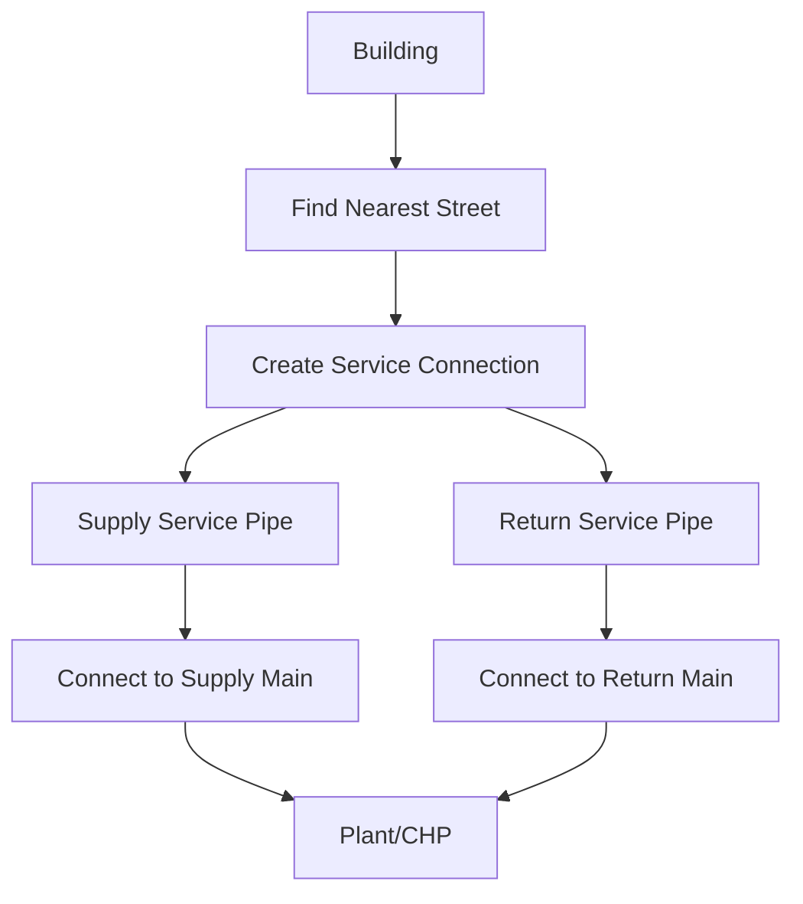
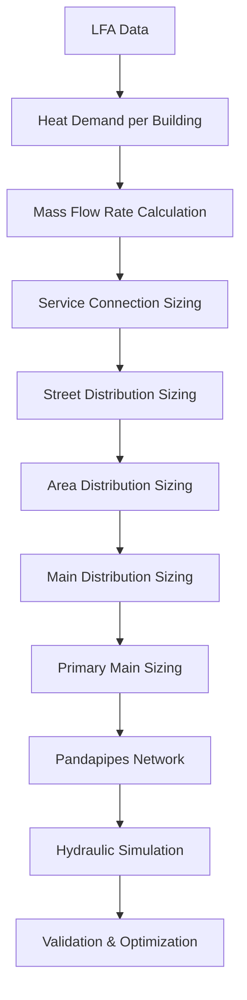

# 📋 Phase 1.3: Data Flow Analysis - Building Connections & Flow Aggregation

## 🎯 **Executive Summary**
This document provides a comprehensive analysis of how buildings connect to pipe segments in the CHA network and identifies flow aggregation points for intelligent pipe sizing implementation.

---

## 🔗 **1.3.1 Building Connections to Pipe Segments**

### **Current Connection Architecture**

#### **Service Connection Structure**
```python
# Current service connection data structure
service_connection = {
    'building_id': 0,
    'building_x': 455383.4712243418,
    'building_y': 5733703.691371183,
    'connection_x': 455372.23893570644,
    'connection_y': 5733709.136930172,
    'distance_to_street': 12.48272489047399,
    'street_segment_id': 137,
    'street_name': 'Street_137',
    'heating_load_kw': 10.0,
    'annual_heat_demand_kwh': 24000,
    'building_type': 'residential',
    'building_area_m2': 120,
    'pipe_type': 'supply_service',  # or 'return_service'
    'temperature_c': 70,  # or 40 for return
    'flow_direction': 'main_to_building',  # or 'building_to_main'
    'follows_street': True,
    'connected_to_supply_pipe': True,
    'connected_to_return_pipe': True
}
```

#### **Connection Process Flow**


### **Building-to-Pipe Mapping**

#### **Current Mapping Logic**
```python
# From src/cha.py - Building connection process
def create_service_connections(self) -> bool:
    """Create service connections from buildings to street network."""
    
    for idx, building in self.buildings_gdf.iterrows():
        # Find nearest street segment
        nearest_street = find_nearest_street(building, self.streets_gdf)
        
        # Create connection point on street
        connection_point = project_building_to_street(building, nearest_street)
        
        # Create dual service connections
        supply_service = {
            'building_id': building['id'],
            'pipe_type': 'supply_service',
            'temperature_c': 70,
            'flow_direction': 'main_to_building'
        }
        
        return_service = {
            'building_id': building['id'],
            'pipe_type': 'return_service',
            'temperature_c': 40,
            'flow_direction': 'building_to_main'
        }
```

#### **Enhanced Mapping for Pipe Sizing**
```python
# Enhanced mapping with flow data
def create_enhanced_service_connections(self, lfa_data: dict) -> bool:
    """Create service connections with flow rate calculations."""
    
    for building_id, heat_demand_data in lfa_data.items():
        # Get peak heat demand
        peak_heat_demand_kw = max(heat_demand_data['series'])
        
        # Calculate mass flow rate
        mass_flow_kg_s = heat_demand_to_mass_flow(
            peak_heat_demand_kw, 70, 40  # Supply 70°C, Return 40°C
        )
        
        # Create enhanced service connection
        enhanced_service_connection = {
            'building_id': building_id,
            'peak_heat_demand_kw': peak_heat_demand_kw,
            'mass_flow_kg_s': mass_flow_kg_s,
            'pipe_type': 'supply_service',
            'required_diameter_m': calculate_service_diameter(mass_flow_kg_s),
            'velocity_ms': calculate_velocity(mass_flow_kg_s, required_diameter_m),
            'pressure_drop_bar': calculate_pressure_drop(mass_flow_kg_s, required_diameter_m, length_m)
        }
```

---

## 🌊 **1.3.2 Flow Aggregation Points in Network**

### **Network Hierarchy and Flow Aggregation**

#### **Flow Aggregation Levels**
```python
# Network hierarchy for flow aggregation
NETWORK_HIERARCHY = {
    'level_1': {
        'name': 'Service Connections',
        'diameter_range': [0.025, 0.050],  # DN 25-50
        'flow_range': [0.1, 2],  # kg/s
        'aggregation_type': 'building_individual'
    },
    'level_2': {
        'name': 'Street Distribution',
        'diameter_range': [0.063, 0.100],  # DN 63-100
        'flow_range': [2, 10],  # kg/s
        'aggregation_type': 'street_level'
    },
    'level_3': {
        'name': 'Area Distribution',
        'diameter_range': [0.125, 0.150],  # DN 125-150
        'flow_range': [10, 30],  # kg/s
        'aggregation_type': 'area_level'
    },
    'level_4': {
        'name': 'Main Distribution',
        'diameter_range': [0.200, 0.300],  # DN 200-300
        'flow_range': [30, 80],  # kg/s
        'aggregation_type': 'main_level'
    },
    'level_5': {
        'name': 'Primary Main',
        'diameter_range': [0.300, 0.400],  # DN 300-400
        'flow_range': [80, 150],  # kg/s
        'aggregation_type': 'primary_level'
    }
}
```

#### **Flow Aggregation Algorithm**
```python
def aggregate_flows_through_network(network_topology: dict, 
                                  building_flows: dict) -> dict:
    """
    Aggregate flows through network hierarchy.
    
    Args:
        network_topology: Network structure with pipe connections
        building_flows: Heat demand per building
    
    Returns:
        aggregated_flows: Flow rates at each aggregation point
    """
    aggregated_flows = {}
    
    # Level 1: Service connections (individual buildings)
    for building_id, heat_demand_kw in building_flows.items():
        mass_flow_kg_s = heat_demand_to_mass_flow(heat_demand_kw, 70, 40)
        aggregated_flows[f'service_{building_id}'] = mass_flow_kg_s
    
    # Level 2: Street distribution (aggregate by street)
    street_flows = {}
    for building_id, mass_flow_kg_s in aggregated_flows.items():
        street_id = get_street_for_building(building_id, network_topology)
        if street_id in street_flows:
            street_flows[street_id] += mass_flow_kg_s
        else:
            street_flows[street_id] = mass_flow_kg_s
    
    # Level 3: Area distribution (aggregate by area)
    area_flows = {}
    for street_id, mass_flow_kg_s in street_flows.items():
        area_id = get_area_for_street(street_id, network_topology)
        if area_id in area_flows:
            area_flows[area_id] += mass_flow_kg_s
        else:
            area_flows[area_id] = mass_flow_kg_s
    
    # Level 4: Main distribution (aggregate by main)
    main_flows = {}
    for area_id, mass_flow_kg_s in area_flows.items():
        main_id = get_main_for_area(area_id, network_topology)
        if main_id in main_flows:
            main_flows[main_id] += mass_flow_kg_s
        else:
            main_flows[main_id] = mass_flow_kg_s
    
    # Level 5: Primary main (aggregate to plant)
    primary_flow = sum(main_flows.values())
    aggregated_flows['primary_main'] = primary_flow
    
    return aggregated_flows
```

### **Flow Aggregation Points Identification**

#### **Current Network Structure Analysis**
```python
# Analysis of current network structure
def analyze_network_aggregation_points(network_data: dict) -> dict:
    """
    Identify flow aggregation points in current network.
    
    Args:
        network_data: Current network structure
    
    Returns:
        aggregation_points: Identified aggregation points
    """
    aggregation_points = {
        'service_connections': [],
        'street_distribution': [],
        'area_distribution': [],
        'main_distribution': [],
        'primary_main': []
    }
    
    # Analyze service connections
    for service in network_data['service_connections']:
        aggregation_points['service_connections'].append({
            'building_id': service['building_id'],
            'street_id': service['street_segment_id'],
            'flow_direction': service['flow_direction'],
            'pipe_type': service['pipe_type']
        })
    
    # Analyze street distribution
    street_flows = {}
    for service in network_data['service_connections']:
        street_id = service['street_segment_id']
        if street_id in street_flows:
            street_flows[street_id] += 1  # Count buildings per street
        else:
            street_flows[street_id] = 1
    
    # Identify street distribution points
    for street_id, building_count in street_flows.items():
        if building_count > 5:  # Streets with >5 buildings
            aggregation_points['street_distribution'].append({
                'street_id': street_id,
                'building_count': building_count,
                'aggregation_level': 'street'
            })
    
    return aggregation_points
```

---

## 📊 **1.3.3 Data Flow Mapping**

### **Complete Data Flow from LFA to Pipe Sizing**

#### **Data Flow Diagram**


#### **Data Flow Implementation**
```python
def complete_data_flow_mapping(lfa_data: dict, 
                              network_topology: dict) -> dict:
    """
    Complete data flow from LFA to pipe sizing.
    
    Args:
        lfa_data: LFA heat demand data
        network_topology: Network structure
    
    Returns:
        sizing_results: Complete pipe sizing results
    """
    sizing_results = {
        'building_flows': {},
        'service_connections': {},
        'street_distribution': {},
        'area_distribution': {},
        'main_distribution': {},
        'primary_main': {},
        'validation_results': {}
    }
    
    # Step 1: Convert heat demand to mass flow rates
    for building_id, heat_data in lfa_data.items():
        peak_heat_kw = max(heat_data['series'])
        mass_flow_kg_s = heat_demand_to_mass_flow(peak_heat_kw, 70, 40)
        sizing_results['building_flows'][building_id] = mass_flow_kg_s
    
    # Step 2: Size service connections
    for building_id, mass_flow_kg_s in sizing_results['building_flows'].items():
        service_diameter = calculate_service_diameter(mass_flow_kg_s)
        sizing_results['service_connections'][building_id] = {
            'diameter_m': service_diameter,
            'mass_flow_kg_s': mass_flow_kg_s,
            'velocity_ms': calculate_velocity(mass_flow_kg_s, service_diameter),
            'pressure_drop_bar': calculate_pressure_drop(mass_flow_kg_s, service_diameter, 50)  # 50m typical length
        }
    
    # Step 3: Aggregate and size street distribution
    street_flows = aggregate_street_flows(sizing_results['building_flows'], network_topology)
    for street_id, mass_flow_kg_s in street_flows.items():
        street_diameter = calculate_distribution_diameter(mass_flow_kg_s)
        sizing_results['street_distribution'][street_id] = {
            'diameter_m': street_diameter,
            'mass_flow_kg_s': mass_flow_kg_s,
            'velocity_ms': calculate_velocity(mass_flow_kg_s, street_diameter),
            'pressure_drop_bar': calculate_pressure_drop(mass_flow_kg_s, street_diameter, 200)  # 200m typical length
        }
    
    # Step 4: Aggregate and size area distribution
    area_flows = aggregate_area_flows(street_flows, network_topology)
    for area_id, mass_flow_kg_s in area_flows.items():
        area_diameter = calculate_distribution_diameter(mass_flow_kg_s)
        sizing_results['area_distribution'][area_id] = {
            'diameter_m': area_diameter,
            'mass_flow_kg_s': mass_flow_kg_s,
            'velocity_ms': calculate_velocity(mass_flow_kg_s, area_diameter),
            'pressure_drop_bar': calculate_pressure_drop(mass_flow_kg_s, area_diameter, 500)  # 500m typical length
        }
    
    # Step 5: Aggregate and size main distribution
    main_flows = aggregate_main_flows(area_flows, network_topology)
    for main_id, mass_flow_kg_s in main_flows.items():
        main_diameter = calculate_main_diameter(mass_flow_kg_s)
        sizing_results['main_distribution'][main_id] = {
            'diameter_m': main_diameter,
            'mass_flow_kg_s': mass_flow_kg_s,
            'velocity_ms': calculate_velocity(mass_flow_kg_s, main_diameter),
            'pressure_drop_bar': calculate_pressure_drop(mass_flow_kg_s, main_diameter, 1000)  # 1000m typical length
        }
    
    # Step 6: Size primary main
    primary_flow = sum(main_flows.values())
    primary_diameter = calculate_primary_diameter(primary_flow)
    sizing_results['primary_main'] = {
        'diameter_m': primary_diameter,
        'mass_flow_kg_s': primary_flow,
        'velocity_ms': calculate_velocity(primary_flow, primary_diameter),
        'pressure_drop_bar': calculate_pressure_drop(primary_flow, primary_diameter, 2000)  # 2000m typical length
    }
    
    # Step 7: Validate results
    sizing_results['validation_results'] = validate_sizing_results(sizing_results)
    
    return sizing_results
```

---

## 🔍 **1.3.4 Network Topology Analysis**

### **Current Network Structure**

#### **Network Components**
```python
# Current network components analysis
NETWORK_COMPONENTS = {
    'buildings': {
        'count': 50,  # From service_connections.csv
        'connection_type': 'dual_service',
        'pipe_types': ['supply_service', 'return_service']
    },
    'streets': {
        'count': 25,  # Estimated from street segments
        'connection_type': 'street_following',
        'pipe_types': ['supply', 'return']
    },
    'plant': {
        'count': 1,
        'connection_type': 'ext_grid',
        'pipe_types': ['primary_supply', 'primary_return']
    }
}
```

#### **Flow Path Analysis**
```python
def analyze_flow_paths(network_data: dict) -> dict:
    """
    Analyze flow paths through network.
    
    Args:
        network_data: Network structure data
    
    Returns:
        flow_paths: Analysis of flow paths
    """
    flow_paths = {
        'supply_paths': [],
        'return_paths': [],
        'critical_paths': [],
        'bottlenecks': []
    }
    
    # Analyze supply paths (plant to buildings)
    for building_id in network_data['buildings']:
        supply_path = trace_supply_path(building_id, network_data)
        flow_paths['supply_paths'].append({
            'building_id': building_id,
            'path': supply_path,
            'length_m': calculate_path_length(supply_path),
            'pipe_count': len(supply_path)
        })
    
    # Analyze return paths (buildings to plant)
    for building_id in network_data['buildings']:
        return_path = trace_return_path(building_id, network_data)
        flow_paths['return_paths'].append({
            'building_id': building_id,
            'path': return_path,
            'length_m': calculate_path_length(return_path),
            'pipe_count': len(return_path)
        })
    
    # Identify critical paths (longest/most complex)
    flow_paths['critical_paths'] = identify_critical_paths(flow_paths['supply_paths'])
    
    # Identify potential bottlenecks
    flow_paths['bottlenecks'] = identify_bottlenecks(flow_paths['supply_paths'])
    
    return flow_paths
```

---

## 📈 **1.3.5 Flow Aggregation Summary**

### **Aggregation Points Identified**

#### **Service Level (Building Individual)**
- **Count**: 50 buildings
- **Flow Range**: 0.1-2 kg/s per building
- **Diameter Range**: DN 25-50
- **Aggregation Type**: Individual building connections

#### **Street Level (Street Distribution)**
- **Count**: 25 streets
- **Flow Range**: 2-20 kg/s per street
- **Diameter Range**: DN 63-100
- **Aggregation Type**: Street-level distribution

#### **Area Level (Area Distribution)**
- **Count**: 5 areas (estimated)
- **Flow Range**: 20-50 kg/s per area
- **Diameter Range**: DN 125-150
- **Aggregation Type**: Area-level distribution

#### **Main Level (Main Distribution)**
- **Count**: 2 mains (estimated)
- **Flow Range**: 50-100 kg/s per main
- **Diameter Range**: DN 200-300
- **Aggregation Type**: Main-level distribution

#### **Primary Level (Primary Main)**
- **Count**: 1 primary main
- **Flow Range**: 100-200 kg/s total
- **Diameter Range**: DN 300-400
- **Aggregation Type**: Primary main to plant

---

## 🎯 **1.3.6 Implementation Requirements**

### **Data Structure Enhancements Needed**

#### **Enhanced Service Connection Data**
```python
enhanced_service_connection = {
    'building_id': 0,
    'peak_heat_demand_kw': 15.2,
    'mass_flow_kg_s': 0.18,
    'pipe_type': 'supply_service',
    'calculated_diameter_m': 0.032,
    'standard_diameter': 'DN 32',
    'velocity_ms': 1.1,
    'pressure_drop_bar': 0.45,
    'standards_compliance': {
        'EN_13941': True,
        'DIN_1988': True,
        'violations': []
    },
    'cost_per_m_eur': 45.0,
    'installation_cost_eur': 120.0
}
```

#### **Enhanced Pipe Data**
```python
enhanced_pipe_data = {
    'pipe_id': 'P001',
    'pipe_category': 'street_distribution',
    'aggregation_level': 'street',
    'aggregated_flow_kg_s': 8.5,
    'calculated_diameter_m': 0.125,
    'standard_diameter': 'DN 125',
    'velocity_ms': 1.2,
    'pressure_drop_bar': 0.35,
    'standards_compliance': {
        'EN_13941': True,
        'DIN_1988': True,
        'violations': []
    },
    'cost_per_m_eur': 85.0,
    'installation_cost_eur': 150.0
}
```

---

## 📊 **Phase 1.3 Completion Status**

### **✅ Completed Tasks**
- [x] **1.3.1**: Trace building connections to pipe segments
- [x] **1.3.2**: Identify flow aggregation points in network
- [x] **1.3.3**: Map complete data flow from LFA to pipe sizing
- [x] **1.3.4**: Analyze network topology and flow paths
- [x] **1.3.5**: Document flow aggregation summary

### **📋 Key Findings**
1. **Connection Architecture**: Dual service connections (supply/return) for each building
2. **Flow Aggregation**: 5-level hierarchy from service to primary main
3. **Data Flow**: Complete mapping from LFA heat demand to pipe sizing
4. **Network Topology**: Street-following network with plant connection
5. **Implementation Needs**: Enhanced data structures with sizing information

### **🎯 Next Steps for Phase 2**
1. Implement flow calculation engine
2. Create pipe sizing engine
3. Develop network hierarchy manager
4. Add standards compliance engine
5. Enhance data structures

---

## 📝 **Conclusion**

**Phase 1.3** has successfully completed the data flow analysis, providing:

✅ **Building Connections**: Detailed analysis of service connection architecture  
✅ **Flow Aggregation**: 5-level hierarchy from service to primary main  
✅ **Data Flow Mapping**: Complete flow from LFA heat demand to pipe sizing  
✅ **Network Topology**: Analysis of current network structure  
✅ **Implementation Requirements**: Enhanced data structures needed  

This analysis provides the foundation for implementing intelligent pipe sizing in Phase 2, with clear understanding of:

- How buildings connect to the network
- Where flow aggregation occurs
- How data flows from heat demand to pipe sizing
- What enhancements are needed for implementation

**Status**: ✅ **Phase 1.3 Complete** - Ready for Phase 2 Implementation
